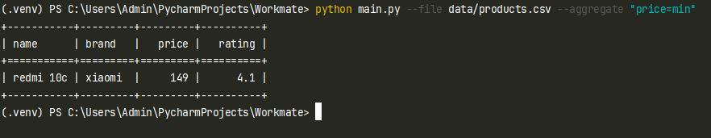
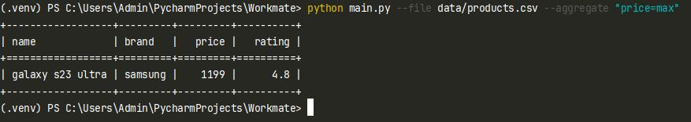
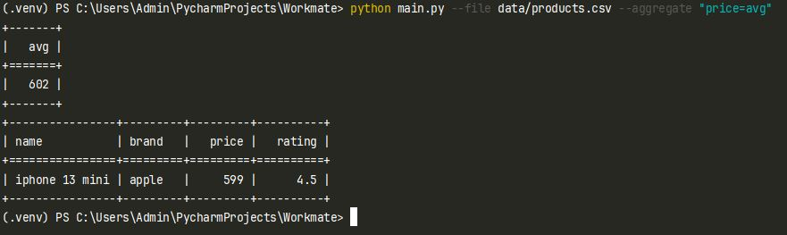
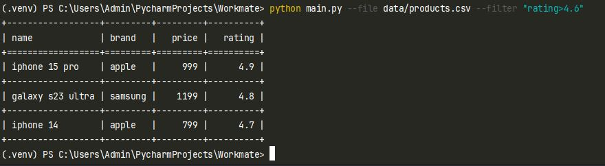
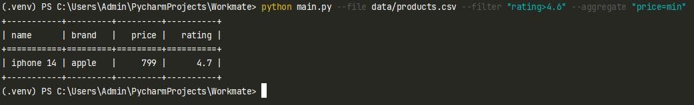
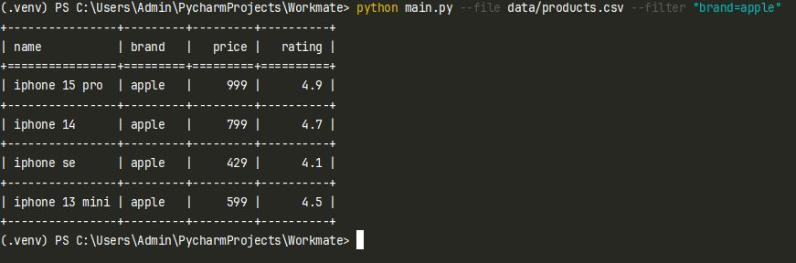

# Тестовое задание для Workmate
___
## Примечания
Для добавления нового функционала (например: добавить --order-by)
необходимо создать класс наследуемый от class Operation в файле src/operations.py.
Затем в файле main.py добавить этот класс в OPERATIONS, указав ключ, по которому будет вызываться операция и сам класс импортированный из operations.py.
### ВАЖНО! В созданном классе обязательно должен быть реализован метод execute().
## Установка и запуск
1. Клонировать проект.
>git clone https://github.com/DeadGEEK990/Workmate 
2. Выполнить команду 
> cd Workmate
3. Установить poetry если его нет.
> pip install poetry 
4. Установить зависимости
> poetry install
5. Запустить тесты
> python -m pytest tests/
6. Выполнить скрипт. Пример команды:
> python main.py --file data/products.csv --aggregate "price=min"
## Примеры запуска скрипта
### Входные данные для всех запусков
 
### Примеры

### AVG выводит не только среднее значение, но товар марсимально близкий к нему

